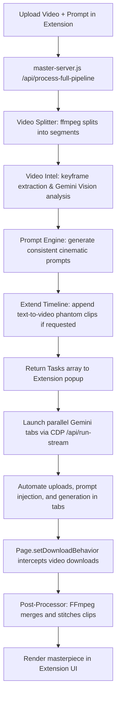

# ♾️ OmniFlow

> **End-to-End Autonomous Video Orchestration Pipeline & Chrome Extension**

OmniFlow is an intelligent developer tool and browser automation pipeline that automates the repetitive workflow of editing videos using generative AI. It splits raw video footage, analyzes it with computer vision, designs consistent high-quality styling prompts, handles browser automation (in parallel tabs) to generate new clips, and stitches them back together into a final masterpiece.

---

## 🚀 Key Features

- **Automated Video Splitting**: FFmpeg-based ingestion that splits your input video into logical segments (default 10 seconds).
- **Video Intelligence (Gemini Vision)**: Analyzes keyframes of each clip to map out environments, characters, clothing, accessories, and shot composition.
- **Prompt Intelligence Engine**: Seamlessly transforms video descriptions into consistent, natural-language prompts. Designed specifically for creative model freedom (omitting rigid technical codes).
- **Text-to-Video Extensions**: Automatically parses user extension commands (e.g. `"add 10 seconds"`), creates "phantom" clips in the timeline, and runs pure text-to-video generations to expand the video duration.
- **Parallel Chrome CDP Automation**: Multi-threaded Chrome automation that launches parallel tabs, navigates to Gemini, uploads source clips using modern CDP file dialog interception, injects prompts, monitors generations, and downloads output files.
- **Fail-Safe Model Fallback**: Automatically falls back to `gemini-1.5-flash` if your active `gemini-2.5-flash` quota is exceeded or unavailable (503 Service Spikes).
- **Seamless Extension UI**: Run the entire pipeline directly from a gorgeous, full-page Chrome Extension popup!

---

## 🛠️ Architecture Workflow



---

## 📦 Installation & Setup

### Prerequisites
Make sure you have [Node.js](https://nodejs.org) (v18+) and [FFmpeg](https://ffmpeg.org) installed on your system.

On macOS, you can install FFmpeg using Homebrew:
```bash
brew install ffmpeg
```

### 1. Clone & Install Dependencies
Clone the repository and install the project dependencies:
```bash
npm install
```

### 2. Configure Environment Variables
Create a `.env` file in the root directory:
```env
# Gemini API Configuration
GEMINI_API_KEY=your_gemini_api_key_here

# Model Configurations
VISION_MODEL=gemini-2.5-flash
PROMPT_ENGINE_MODEL=gemini-2.5-flash
```

### 3. Load the Chrome Extension
1. Open Google Chrome and navigate to `chrome://extensions/`.
2. Enable **Developer mode** (toggle in the top-right).
3. Click **Load unpacked** in the top-left.
4. Select the `extension/` directory inside this project.
5. The OmniFlow icon will now appear in your extension toolbar.

---

## 🏃 Running OmniFlow

### Step 1: Start Chrome in Remote Debugging Mode
Chrome must be running with remote debugging enabled on port `9222` so that the CDP (Chrome DevTools Protocol) scripts can control tabs:

**On macOS:**
```bash
/Applications/Google\ Chrome.app/Contents/MacOS/Google\ Chrome --remote-debugging-port=9222
```

### Step 2: Start the Master Pipeline Server
Launch the Node backend server:
```bash
npm start
```
The server will run on `http://localhost:3007`.

### Step 3: Launch the Extension & Run
1. Click the **OmniFlow** extension icon in Chrome (this opens a full-page interface tab).
2. **Drag and drop** your source video file (MP4/MOV).
3. Enter your **AI Editing Target Prompt** (e.g., `"Make it cyberpunk and add 10 seconds"`).
4. Enter your custom Gemini API key (optional; if left blank, the server will use the key configured in `.env`).
5. Set your Chrome Debug Port (default is `9222`).
6. Click **Run Full OmniFlow Pipeline**.
7. Watch the execution tracker compile, analyze, generate parallel tabs, and stitch your final video!

---

## 📝 License

Distributed under the MIT License. See `LICENSE` for details.
